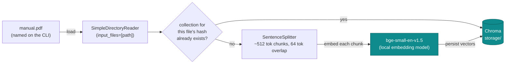
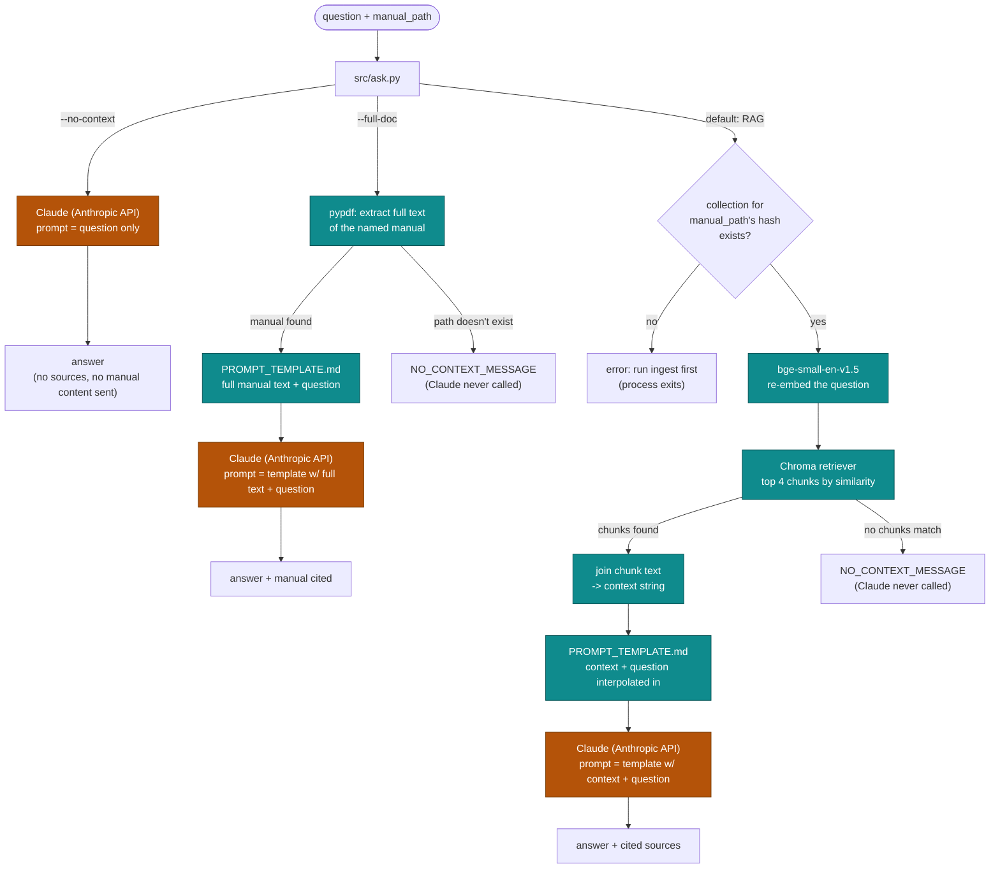

# RAG pipeline anatomy

The manual is always named explicitly on the command line, never
auto-discovered from a directory. Two separate runs make up the pipeline:
`python -m src.ingest <manual.pdf>` builds the vector index once, offline;
`python -m src.ask` answers a question against it every time you run it.
The diagrams below trace what each one actually touches — including which
hops are local computation and which leave the machine.

## Ingest-time (`python -m src.ingest <manual.pdf>`, run once per manual)

Loads the PDF named on the command line, splits it into overlapping
chunks, embeds each chunk with a local sentence-transformer, and writes the
resulting vectors to a Chroma collection named by a hash of the manual's
content. Re-ingesting the same file is a no-op (existing collection reused,
no re-embedding); a different file gets its own collection alongside it.

Everything here runs on your machine — no API key is used during
ingestion. The manual only needs to be re-embedded when it changes.

## Query-time (`python -m src.ask`, every invocation)

`python -m src.ask "<question>" <manual_path> [--full-doc | --no-context]`.
`manual_path` is required for the default RAG mode and `--full-doc`; only
`--no-context` needs no manual at all. Three mutually exclusive modes:

- **`--no-context`** sends **only the bare question string** to Claude as the
  completion prompt — no manual content of any kind, not even the raw PDF
  text, is attached. A purely un-grounded baseline.
- **`--full-doc`** skips retrieval entirely and sends the named manual's
  **full extracted text** (via `pypdf`, no chunking/embedding involved) as
  context. No Chroma, no embedding model — but the entire manual's text
  goes into the prompt on every call, bigger and costlier than RAG's top-4
  chunks. Reads the PDF fresh each call, independent of `storage/`.
- **default (RAG)** re-embeds the question with the *same* local model used
  at ingest time — embeddings from two different models aren't comparable —
  opens the Chroma collection matching `manual_path`'s content hash,
  retrieves the top 4 chunks, joins their raw text into a single `context`
  string, and interpolates that plus the question into `PROMPT_TEMPLATE.md`
  before calling Claude.

**Why `ask` feels slow:** the embedding model is loaded fresh on every
single invocation before Claude is ever reached — that model load plus a
handful of Hugging Face Hub metadata checks dominate the wall-clock time,
not the Claude call itself. `--no-context` skips all of it (`--full-doc`
still skips the embedding model, but reads and sends more text per call
than RAG mode). This is inherent to
a single-shot CLI process; a persistent session (see the `interactive-cli`
stub under `openspec/changes/`) would let the embedding model be loaded
once and reused across questions instead of reloaded per invocation.

## Components at a glance

| Component | Runs | Used by |
|---|---|---|
| `bge-small-en-v1.5` | local | ingest (embed chunks) & default RAG mode (embed question) — must match on both sides |
| Chroma / `storage/` | local | one collection per manual, named by content hash, reused if unchanged; read by the retriever in RAG mode only |
| `pypdf` | local | `--full-doc` mode's direct PDF text extraction; no chunking or embeddings involved |
| Claude (Anthropic API) | network | every `ask.py` call, any mode — the only step that needs `ANTHROPIC_API_KEY` |
| Hugging Face Hub | network | metadata/version checks when loading the embedding model, on both ingest and default RAG mode |
