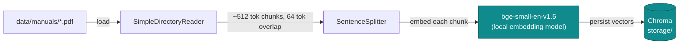
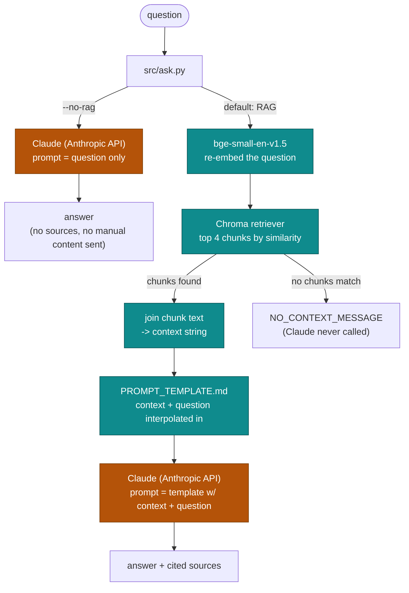

# RAG pipeline anatomy

Two separate runs make up this project: `python -m src.ingest` builds the
vector index once, offline; `python -m src.ask` answers a question against
it every time you run it. The diagrams below trace what each one actually
touches — including which hops are local computation and which leave the
machine.

## Ingest-time (`python -m src.ingest`, run once per manual set)

Reads every PDF under `data/manuals/`, splits each into overlapping chunks,
embeds each chunk with a local sentence-transformer, and writes the
resulting vectors to a persistent Chroma collection on disk.

Everything here runs on your machine — no API key is used during
ingestion. The manual only needs to be re-embedded when it changes.

## Query-time (`python -m src.ask`, every invocation)

`--no-rag` sends **only the bare question string** to Claude as the completion
prompt — no manual content of any kind, not even the raw PDF text, is
attached. It exists purely as an un-grounded baseline to compare against RAG
mode. The default path re-embeds the question with the *same* local model
used at ingest time — embeddings from two different models aren't
comparable — retrieves the top 4 chunks from Chroma, joins their raw text
into a single `context` string, and interpolates that plus the question into
`PROMPT_TEMPLATE.md` before calling Claude.

**Why `ask` feels slow:** the embedding model is loaded fresh on every
single invocation before Claude is ever reached — that model load plus a
handful of Hugging Face Hub metadata checks dominate the wall-clock time,
not the Claude call itself. `--no-rag` skips all of it. This is inherent to
a single-shot CLI process; a persistent session (see the `interactive-cli`
stub under `openspec/changes/`) would let the embedding model be loaded
once and reused across questions instead of reloaded per invocation.

## Components at a glance

| Component | Runs | Used by |
|---|---|---|
| `bge-small-en-v1.5` | local | ingest (embed chunks) & ask-rag (embed question) — must match on both sides |
| Chroma / `storage/` | local | persists chunk vectors; read by the retriever in RAG mode only |
| Claude (Anthropic API) | network | every `ask.py` call, RAG or not — the only step that needs `ANTHROPIC_API_KEY` |
| Hugging Face Hub | network | metadata/version checks when loading the embedding model, on both ingest and ask-rag |
